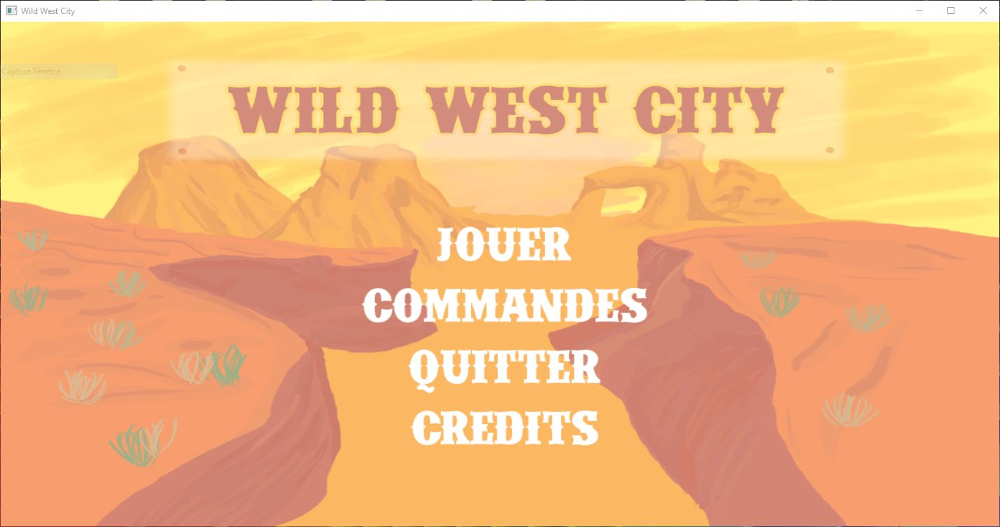
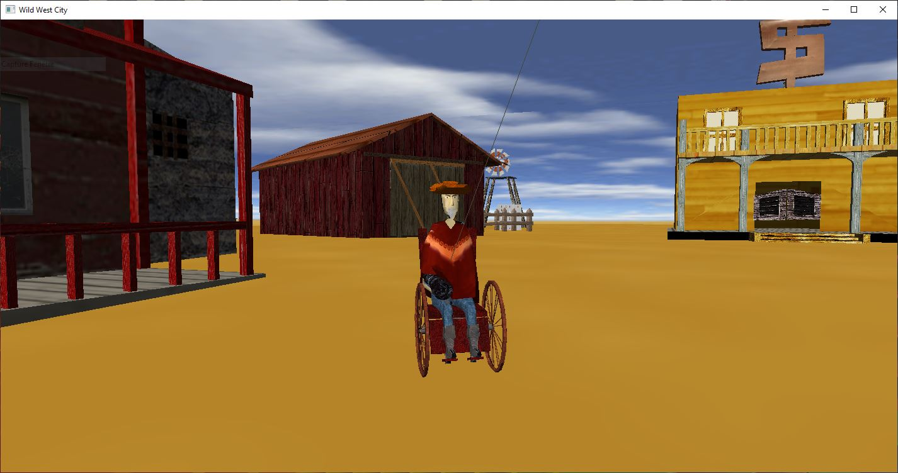

# Wild-West-City
first video game project - Feeling nostalgic 👴 Remember boyz? the good old days!  

It was made in 2009 for my technical degree.  
It was all about discovering OpenGL, integrating 3D textured models, adding a physics library and basic gameplay mechanics in C++ project from scratch.   
Not cheating here 💪 No Irrlicht engine and of course no Unity, no Unreal Engine

## History
In this game you will incarn "Billy" the cowboy. He is disabled but he is vailant!  
Why is he disabled? Officially because he fell one day down his horse, Informally because developers were too unexperienced to implement SkinnedMeshes and create biped animations. 

Billy will have to take care of his lovely town by doing some tasks:
- Fighting alcoolism in this Wild west city. By breaking bottles of beer hidden on the map
- Park cows to the cattle pen using a horrible inertia
- and many more... ( what a teaser! )

Optionally, you can activate full screen support to take advantage of these amazing graphics in full 8k/200fps video rendering.

## Tech

Using : 
- C/C++ and OpenGL 2.0
- [Newton Game Dynamics](https://github.com/MADEAPPS/newton-dynamics) for incredible physics works - included in this repo
- Old Qt 4.6.0 for Window and keyboard/Mouse events
- 3DS Loader from DigiBen - gametutorials.com ( no link found sorry )

The installer was made with : Microsoft Visual Studio Installer Projects

## Install 

An installer is embedded in this repo [here]()

## Development

If you want to download sources and compile by yourself (I don't know why, but why not), you will need to download [Qt 4.6.0](https://download.qt.io/archive/qt/4.6/) from the Qt archives repository and resolve includes and lib linking in the project configuration.  
To do that you will have to set an Env variable QTDIR pointing your Qt install directory   
The default path to Qt is : *C:\Qt\4.6.0*

Build was tested on Visual studio 2019 and All is fine.  
After building, simply copy Qt dlls in Debug | Release folder

Currently the projet version is 1.0 and there is no more update on roadmap 🙃
Maybe a vulkan adaptation one day...

Developers:   
We were 4 people on this project. 
 - 2 developpers, Loïc and I
 - full artist Ouirich
 - one half artist and integrator, Vincent

We were unskilled but we were passionated  
Thanks to them for this amazing work!  

## Menu

### Hidy ho Billy!
